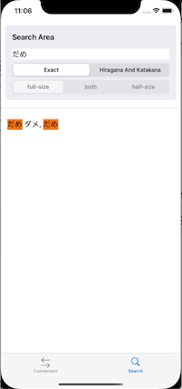

# JapaneseConversion
This is the sample code about converting and searching Japanese string, allowing changing the options to find text with exact Katakana, Hiragana, or both. 

It's the first time I use MVVM Architecture, SwiftUI in combination with Combine. So I doubt of the code what I have written 😙😙😙😙.
If something goes wrong, please let me in on it. I'd appreciate that.

### Previews
 


### Achieve

I've used the constant below to distinguish characters which one is katakana, hiragana, or neither
```swift
    struct Constant {
        static let minKatakana: UInt32 = 0x30a0
        static let maxKatakana: UInt32 = 0x30ff
        static let minHiragana: UInt32 = 0x3040
        static let maxHiragana: UInt32 = 0x309f
        static let nonExistentHiragana: [UInt32] = [0x3040, 0x3097, 0x3098]
        static let minKanji: UInt32 = 0x4e00
        static let maxKnaji: UInt32 = 0x9faf
    }
```

Then you can convert char by char to get a complete converted string. Note, You have to handle the logic by yourself. This approach is good if you want more control in translation.
```swift
    extension String {
        func toKataKana() -> String {
            let converted = self.reduce("") { (result, char) -> String in
                return result + String(char.toKatakana())
            }

            return converted
        }
    }
```

Or you can use `CFStringTransform` either to get a converted string. All logic of transformation will be handled by the CoreFoundation framework. So It's always true unless your application has any particular requirement.
```swift
    func toKatakana() -> String {
        let str = NSString(string: self)
        let convertedString: CFMutableString = str.mutableCopy() as! CFMutableString
    
        CFStringTransform(convertedString, nil, kCFStringTransformHiraganaKatakana, false)
        
        return String(convertedString)
    }
```

Lastly, If you want to translate between full-width and hafl-width form, it's also supported. Look at `kCFStringTransformFullwidthHalfwidth` key to get more detail.


### References
- https://en.wikipedia.org/wiki/Hiragana_(Unicode_block)
- https://en.wikipedia.org/wiki/Katakana_(Unicode_block)
- https://en.wikipedia.org/wiki/Half-width_kana
- https://izsak.hatenadiary.org/entry/20100508/1273334470
